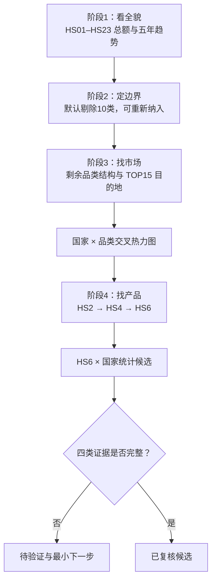

# 中国食品出口机会探索网站设计规格

日期：2026-07-17  
状态：已完成概念设计，等待主任务复核后编写实施计划

## 1. 项目目标

建设一个部署在 Vercel 的公开交互网站，用真实贸易数据带领外贸新手团队完成以下分析路径：

```text
理解中国农业及食品相关出口总盘子
→ 查看 HS01–HS23 大类结构
→ 按公司能力暂时剔除不适合的类别
→ 观察剩余品类的国家分布和五年趋势
→ 找出主要目标市场
→ 从 HS2 下钻到 HS4、HS6
→ 形成“HS6 产品 × 目标国家”统计候选
→ 明确还需验证的买家、准入、供给和商业证据
```

本网站不是普通数据看板，也不是自动推荐器。它的核心作用是把团队从宏观出口数据引导到可验证的产品—国家组合。

## 2. 已确认的产品决策

- 采用引导模式为主、自由探索为辅的信息架构。
- 初始统计范围为 HS01–HS23。
- 默认剔除 HS01、HS05、HS06、HS11、HS13、HS14、HS15、HS18、HS22、HS23。
- 默认剔除项允许重新纳入，并即时重算后续统计。
- 时间范围为 2020–2024 五个完整年度。
- 数据下钻到 HS6；HS6 之后使用产品验证卡，不把 HS6 冒充为 SKU。
- 网站公开部署到 Vercel。
- 第一版为纯查看模式，不提供登录、收藏、批注或团队共享候选池。
- 贸易数据预计算后发布，不在浏览器运行时调用 Comtrade API。
- 数据按年度刷新；2025 成为完整且可用年度后再生成新版。

## 3. 分析对象和表述边界

第一屏不得把 HS01–HS23 直接称为“全部食品出口”。推荐标题为：

> 中国 HS01–HS23 农业及食品相关出口总额

原因是 HS01–HS23 包含活体动物、植物材料、工业原料和饲料等，不全是可直接销售的食品。

默认剔除的 10 个类别也不得表述为“行业上不能做”。统一使用：

> 基于当前公司的产品能力和第一轮研究范围，暂不纳入。

默认保留的 13 类只代表“允许继续研究”，不代表都适合小公司。例如 HS02、HS03、HS04、HS16 仍可能涉及动物检疫、冷链、境外企业注册及较高食品安全风险。

网站最终分析单元为：

> HS6 统计品目 × 目标国家或关税区

任何结论必须区分：

- 已验证事实；
- 确定性计算；
- 推测；
- 待验证；
- 数据或访问受限。

## 4. 总体信息架构

将原先较长的章节压缩为五个决策阶段：

| 阶段 | 核心问题 | 阶段输出 |
|---|---|---|
| 1. 看全貌 | 中国农业及食品相关出口盘子有多大？ | HS01–HS23 总额、结构和五年变化 |
| 2. 定边界 | 哪些类别暂不适合公司？ | 默认剩余 13 类及可恢复的剔除范围 |
| 3. 找市场 | 哪些国家存在真实贸易基础？ | TOP15 目的地及国家—品类交叉结构 |
| 4. 找产品 | 哪些产品—国家组合值得继续研究？ | HS2 → HS4 → HS6 统计候选 |
| 5. 做验证 | 大出口额是否能转化为进入机会？ | 前20复核队列、前5深度验证方向 |

页面关系：



每个阶段结尾必须说明：

- 本阶段观察到了什么；
- 排除了什么；
- 保留了什么；
- 下一阶段要回答什么问题。

## 5. 阶段1：看全貌

### 5.1 总额和趋势

展示：

- 2024 年 HS01–HS23 出口总额；
- 2020–2024 五年折线；
- 最新同比；
- 五年 CAGR；
- 数据年份、来源、抓取日期和 HS 版本；
- 人民币/美元显示切换。

金额默认显示人民币，方便团队理解，但所有同比、CAGR、市场份额和评分必须基于原始美元值计算。人民币仅是显示层，每年使用对应年度平均汇率，且注明人民币趋势包含汇率影响。

### 5.2 HS01–HS23 排序

使用横向排序条形图。每行显示：

- HS2 编码；
- 中文名称；
- 2024 出口额；
- 占 HS01–HS23 总额比例；
- 2020–2024 CAGR；
- 五年迷你趋势；
- 当前状态：保留、默认剔除或重新纳入。

支持按以下指标排序：

- 2024 出口额；
- 五年 CAGR；
- 最新同比；
- 波动程度。

点击大类可临时展开其五年趋势、前5目的地、最大 HS4 子类和当前排除状态。

## 6. 阶段2：定边界

### 6.1 默认剔除卡

为 10 个默认剔除类别各制作一张说明卡：

- HS 编码及名称；
- 2024 出口额；
- 当前剔除原因；
- 可能需要的企业能力；
- 主要准入或经营风险；
- 重新纳入按钮；
- 重新纳入后研究池增加的金额和比例。

剔除原因使用统一标签：

- 动植物检疫要求高；
- 冷链或特殊仓储；
- 原料属性强；
- 渠道特殊；
- 认证或注册成本高；
- 品牌竞争激烈；
- 当前供应链不匹配。

用户重新纳入某类后，后续总额、排名和国家占比即时重算。页面必须提供“恢复默认范围”按钮。

### 6.2 第二层风险标签

剩余 13 类仍需按 HS4 或 HS6 标记风险：

- 绿色：常温、保质期长、一般加工食品；
- 黄色：需要检测、特定标签或认证；
- 橙色：冷链、检疫或企业注册要求高；
- 红色：当前公司条件下不建议进入；
- 灰色：证据不足，不能判断。

风险颜色必须同时配有文字，不得只靠颜色表达。

## 7. 阶段3：找市场

### 7.1 剩余产品大类排序

图表 A 为大类出口额排名，每行显示：

- 2024 出口额；
- 五年 CAGR；
- 最新同比；
- 占当前研究池比例；
- 前5目的地标签；
- 风险等级。

图表 B 为目的地构成堆叠条形图。每个大类只显示前5目的地，其余合并为灰色“其他”。不得为近200个目的地使用近200种颜色。

交互包括：

- 年份切换；
- 出口额/国家占比切换；
- 点击国家色块进入国家详情；
- 点击“其他”查看完整国家排名；
- 重新纳入类别后即时重算；
- 直接标签和可访问的文本替代。

### 7.2 TOP15 目的地

使用横向排序条形图作为主图，地图仅作辅助定位。

每个国家或关税区显示：

- 2024 出口额；
- 占当前研究池比例；
- 2020–2024 CAGR；
- 主要出口的前3个 HS4 产品；
- 市场角色：终端消费市场、区域分销中心、可能转口或证据不足；
- 初步进入阶段：前期、条件进入或后期。

香港、新加坡、荷兰等可能存在转口的市场必须显式标注，不能把中国对该地出口额直接等同于当地终端消费。

### 7.3 国家 × 产品交叉热力图

这是网站的核心决策视图：

- 行：保留的 HS2 或 HS4 产品；
- 列：TOP15 目的地；
- 单元格：产品对该地出口额；
- 颜色深浅：金额；
- 趋势符号：上升、下降、波动或数据不足；
- 点击单元格：进入产品—国家详情。

热力图用于发现：

1. 产品整体很大，但集中在少数市场；
2. 目的地整体很大，但某产品的中国份额很低；
3. 当前金额不大，但连续五年稳定增长；
4. 中国份额很高、竞争可能已经拥挤；
5. 出口增长与目标国总进口增长是否同步。

## 8. 阶段4：HS2 → HS4 → HS6 下钻

不采用无限缩放。使用明确的面包屑和层级过渡：

```text
全部范围
> HS07 食用蔬菜
> HS0712 干制蔬菜
> HS071290 其他干制蔬菜
> 日本市场
```

每层保留：

- 返回上一级；
- 当前金额；
- 在父级中的占比；
- 五年趋势；
- 同级排名；
- 国家分布；
- 数据来源和边界。

### 8.1 HS4 页面

- HS4 子类出口额排名；
- 五年趋势；
- 前5目的地构成；
- 国家集中度；
- 风险标签；
- 进入 HS6 的入口。

### 8.2 HS6 页面

- HS6 编码和中文辅助名称；
- 2024 中国对全球出口额；
- 五年 CAGR 和最新同比；
- 主要目的地；
- 各目的地五年变化；
- 目标国从全球进口额；
- 目标国从中国进口额；
- 中国份额；
- 主要竞争供应国；
- 供应国集中度；
- 单位价值，仅在数量和单位可比时显示；
- 数据完整度和置信度。

页面必须提示：

> 一个 HS6 编码可能包含多个具体产品、等级、用途和包装，不能直接等同于可销售 SKU。

## 9. 阶段5：产品—目标国家验证卡

### 9.1 自动统计卡

所有有完整数据的 HS6 × 国家组合可自动生成：

- HS6 编码及名称；
- 目标市场；
- 目标市场五年总进口趋势；
- 从中国进口趋势；
- 中国份额；
- 前3竞争供应国；
- 供应国集中度；
- 单位价值可用性；
- 数据置信度；
- 统计候选原因；
- 数据缺口。

### 9.2 人工验证卡

只对前20候选建立人工复核卡，对前5做深度研究：

- 可能对应的具体产品形态；
- 包装、用途和买家类型；
- 可识别买家、进口商或分销商证据；
- 标签、添加剂、检疫和认证要求；
- 关税及贸易救济；
- 运输、保质期和售后风险；
- 中国供应链和产业带证据；
- 报价、运费和买家价格验证状态；
- 最小下一步验证动作。

允许的状态为：

- 统计候选；
- 待验证；
- 高风险；
- 继续研究；
- 已完成四类证据复核。

只有需求、买家、准入和中国供给四类证据齐全，才能标为“已复核候选”。不得自动显示“推荐进入”。

## 10. 交互和视觉设计

### 10.1 引导模式

- 固定章节导航；
- 当前步骤和进度；
- 每阶段一个主要判断任务；
- 每阶段结尾显示结论和下一步；
- 可随时进入自由探索；
- 浏览器前进和后退有效；
- URL 保存年份、国家、HS 层级和指标；
- 当前视图可复制链接分享。

### 10.2 探索功能

- 搜索 HS 编码、中文名称和国家；
- 年份、指标和金额范围筛选；
- 图表全屏；
- 数据范围滑块；
- 地图缩放；
- 一键恢复默认范围；
- 加载中、部分数据、无数据和失败状态。

### 10.3 动效

动效只服务层级变化：

- 排序切换平滑移动；
- 剔除项淡出进入“已排除”区域；
- 大类展开为国家构成；
- HS2 进入 HS4 时保持视觉连续性。

动画建议为 250–400 毫秒，并支持减少动态效果。

### 10.4 色彩角色

- 深绿色：主数据和当前选择；
- 浅绿色：次级数据；
- 蓝色系：国家构成；
- 琥珀色：风险或待验证；
- 红色：明确高风险；
- 灰色：其他、剔除、缺失和不可判断。

所有关键数据直接显示，不依赖悬浮。移动端用点击或聚焦替代悬浮，并将复杂图表改为卡片、分组排名或横向滚动视图。

## 11. 数据口径和方法

### 11.1 范围

- 报告国：中国；
- 年份：2020–2024；
- 初始商品范围：HS01–HS23；
- 默认研究池：剩余13类；
- 商品层级：HS2、HS4、HS6；
- 目的地：全球国家和关税区；
- 深度机会验证：优先 TOP15 目的地；
- 人工复核：前20；
- 深度研究：前5。

### 11.2 HS 版本

五年数据必须锁定同一个 HS 版本。建议先验证 HS2017 对中国 2020–2024 数据的覆盖率；若不能满足完整性门槛，再根据 Comtrade 元数据选择一个五年均可比的版本。

不得混用不同 HS 版本计算增长率。

### 11.3 来源

- 主贸易统计：UN Comtrade；
- OEC/BACI：现有页面迁移、横向复核和差异解释；
- WITS：少量聚合值复核；
- 汇率：每年对应的人民币兑美元平均汇率；
- 市场准入：目标国政府和监管机构；
- 买家证据：进口商、分销商、协会、展会和采购目录。

一个图表内只使用一个统计来源，不混合相加 Comtrade、BACI 或 WITS 金额。

### 11.4 必须计算的指标

- 出口额；
- 同比；
- 五年 CAGR；
- 产品占比；
- 国家占比；
- 目标国总进口额；
- 目标国从中国进口额；
- 中国份额；
- 供应国集中度；
- 波动程度；
- 数据完整度和置信度。

缺失指标不得由模型猜测。单位价值只有在数量、重量和单位可比时才能计算。

## 12. 数据架构

网站运行时不调用 Comtrade API，也不包含 API Key。所有数据由年度构建脚本预计算、缓存、校验和分块。

建议结构：

```text
public/data/
  manifest.json
  overview.json
  sources.json
  exclusions.json
  categories/
    02.json
    03.json
  countries/
    JPN.json
    USA.json
  products/
    071290.json
  markets/
    JPN-071290.json
  validation-cards/
    JPN-071290.json
```

加载规则：

- 首页只加载总览和 HS2 数据；
- 点击大类后加载类别数据；
- 点击国家后加载国家数据；
- 点击 HS6 后加载产品和市场数据；
- 小额长尾可聚合为“其他”，但总额必须保持一致；
- 不允许浏览器一次加载全球所有 HS6 明细。

每个数据文件包含：

- 来源 URL；
- 发布者；
- 数据年份；
- 抓取时间；
- HS 版本；
- 运行参数；
- 完整性状态；
- 已知缺口。

## 13. 技术架构

推荐：

- Next.js + TypeScript；
- Apache ECharts 负责排序条形图、堆叠图、折线图、热力图、地图和数据缩放；
- Python 负责数据抓取、缓存、聚合、校验和年度刷新；
- 静态 JSON 数据；
- Vercel 公开部署；
- 无账号、数据库和业务后端；
- URL 参数保存探索状态。

主要路由：

```text
/                    引导式主页面
/explore             自由探索入口
/explore?hs2=07
/explore?hs2=07&hs4=0712
/explore?hs6=071290&country=JPN
```

不为每个 HS6 和国家生成独立静态页面，避免路由数量失控。

## 14. 第一版范围

### 14.1 全量统计覆盖

- HS01–HS23；
- 2020–2024；
- HS2 和 HS4；
- 全部目的地；
- 默认剔除和重新纳入；
- TOP15 目的地。

### 14.2 深度覆盖

- 默认保留的 13 类；
- TOP15 目的地；
- HS6 贸易数据；
- 产品—国家交叉分析；
- 自动统计卡。

### 14.3 人工研究覆盖

- 前20统计候选复核；
- 前5深度研究；
- 需求、买家、准入和中国供给四类证据。

重新纳入默认剔除类别时，网站必须重算 HS2、HS4 和国家结构；如果该类别没有完整 HS6 研究数据，应明确显示“已加入统计范围，深度数据尚未复核”。

### 14.4 第一版不包含

- 登录和成员系统；
- 收藏、批注和共享候选池；
- CRM；
- 自动开发信；
- 供应商寻找；
- 实时 Comtrade 调用；
- 自动利润结论；
- 所有国家 8–10 位本国税号；
- 全部 HS6 的人工验证；
- 未经证据支持的“推荐进入”；
- 装饰性 3D、飞线或无限缩放。

## 15. 数据审计先行

前端实施前必须完成一条端到端数据样本：

1. 选择一个 HS2；
2. 下钻一个 HS4；
3. 下钻一个 HS6；
4. 覆盖 2020–2024；
5. 覆盖中国对全球出口；
6. 覆盖目标国从全球进口；
7. 覆盖目标国从中国进口；
8. 验证父子金额；
9. 验证 HS 版本；
10. 验证数量单位；
11. 验证数据分块体积和 Vercel 构建可行性。

数据审计未通过前，不批量抓取全站数据，也不开发复杂图表。

## 16. 异常和降级

必须处理：

- 年度数据缺失；
- 国家数据不足；
- 父子金额不完全一致；
- HS 版本冲突；
- 数量单位不可比；
- 重新纳入类别缺少 HS6 数据；
- 网络或数据文件加载失败；
- 图表渲染失败；
- 手机屏幕过窄；
- 用户启用减少动态效果。

原则：

- 无数据不等于零；
- 部分数据必须标注；
- 图表失败时展示可读表格；
- 父子差异进入来源说明，不静默修正；
- 失败状态提供重试和返回上一级；
- 核心结论不依赖动画或悬浮。

## 17. 测试和验收

### 17.1 数据测试

- 父级金额与子级加总一致；
- 国家份额含“其他”后加总为 100%；
- 无重复 HS—国家—年度记录；
- 仅使用完整年度；
- CAGR、同比和排序可复算；
- 排除和重新纳入计算正确；
- 缺失值不会被当作零；
- 汇率只影响显示金额，不影响美元口径指标；
- 单位价值只在计量单位一致时产生。

### 17.2 交互测试

- 可完成 HS2 → HS4 → HS6 → 国家验证卡路径；
- 浏览器前进和后退恢复状态；
- URL 恢复年份、指标、国家和 HS 层级；
- 重置功能恢复默认10类剔除状态；
- 点击“其他”可进入完整国家列表；
- 图表全屏和范围缩放正常；
- 键盘可以操作核心控件；
- 减少动态效果设置生效；
- 手机端不依赖悬浮。

### 17.3 业务验收

外贸新手应能够：

1. 说清 HS01–HS23 总盘子；
2. 看懂 23 类金额和趋势；
3. 理解默认剔除的公司边界；
4. 恢复类别并看到重算结果；
5. 找到剩余品类的主要市场；
6. 看懂 TOP15 目的地及其主要产品；
7. 从 HS2 下钻到 HS6；
8. 选择一个 HS6 × 国家组合；
9. 区分统计候选与已复核候选；
10. 找到所有关键数字的来源和缺口。

### 17.4 部署验收

- Vercel 生产部署成功；
- 公开链接可访问；
- 不包含 Comtrade API Key；
- 数据按需加载；
- 首屏不加载全球 HS6 数据；
- 关键数据在图表失败时仍可读；
- 来源、年份和更新时间清晰可见。

## 18. 实施顺序建议

1. 数据口径和 HS 版本审计；
2. 端到端样本数据链；
3. 数据构建、缓存和校验脚本；
4. 五阶段引导式页面骨架；
5. HS01–HS23 总览及剔除交互；
6. 品类、国家和交叉热力图；
7. HS2、HS4、HS6 下钻；
8. 自动统计卡；
9. 前20人工复核和前5深度卡；
10. 移动端、可访问性和降级；
11. Vercel 部署和生产验证。

## 19. 最终产品原则

网站的成功标准不是“能点击很多层”，而是：

> 团队每完成一次下钻，都更接近一个可验证的产品—国家候选，同时清楚知道该判断由哪些证据支持、还缺哪些证据。

必须长期坚持：

- 先列证据，再下判断；
- 出口额不等于利润；
- HS6 不等于 SKU；
- 中国出口大不等于目标市场有新增机会；
- 缺失数据不猜测；
- 不为了凑满候选而降低证据标准。
